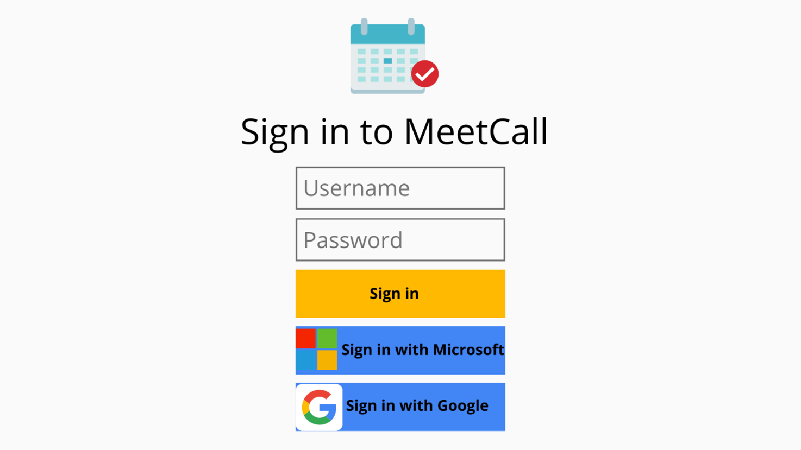
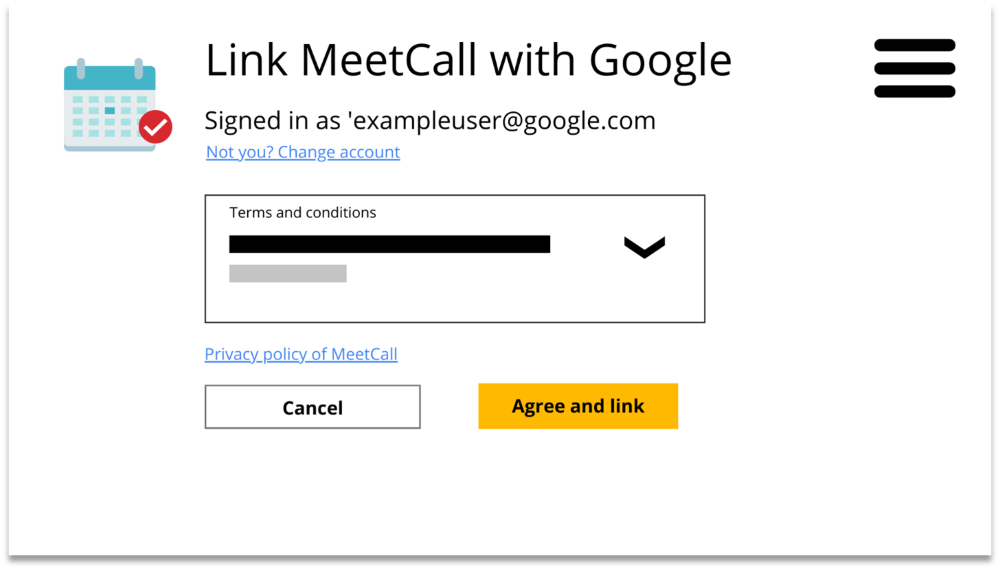
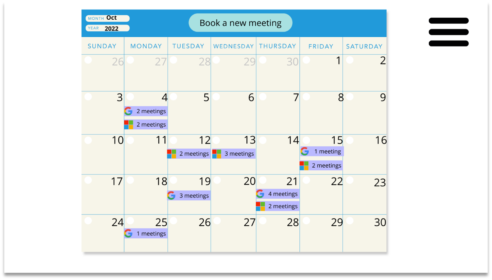
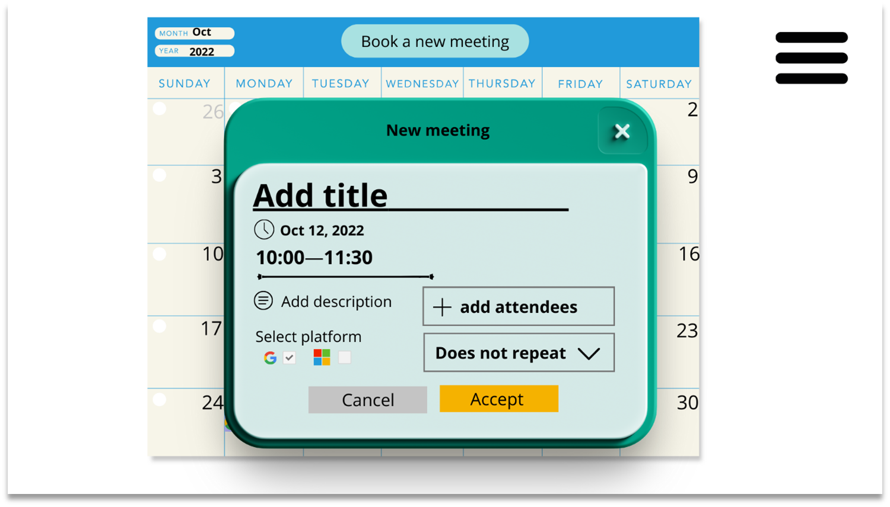
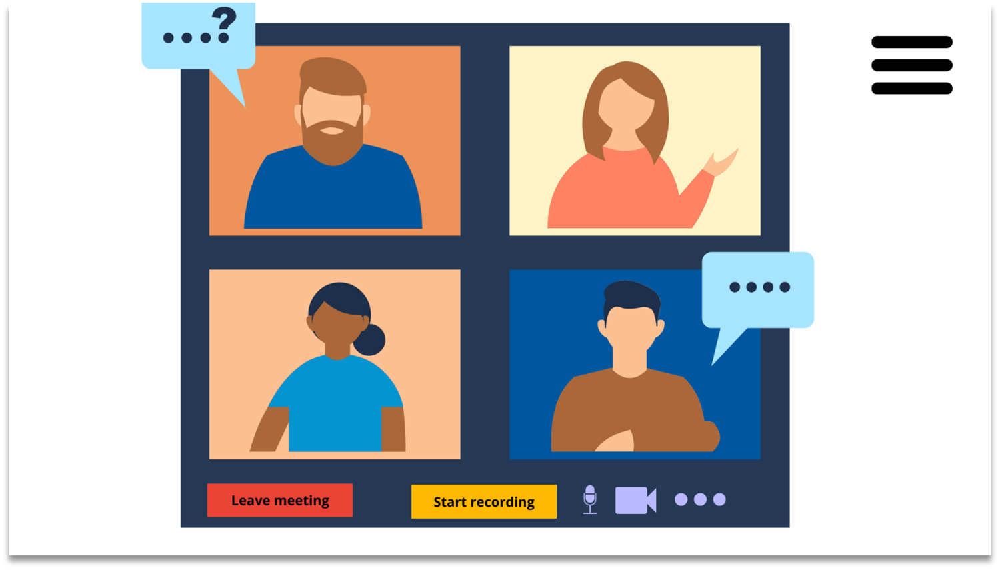
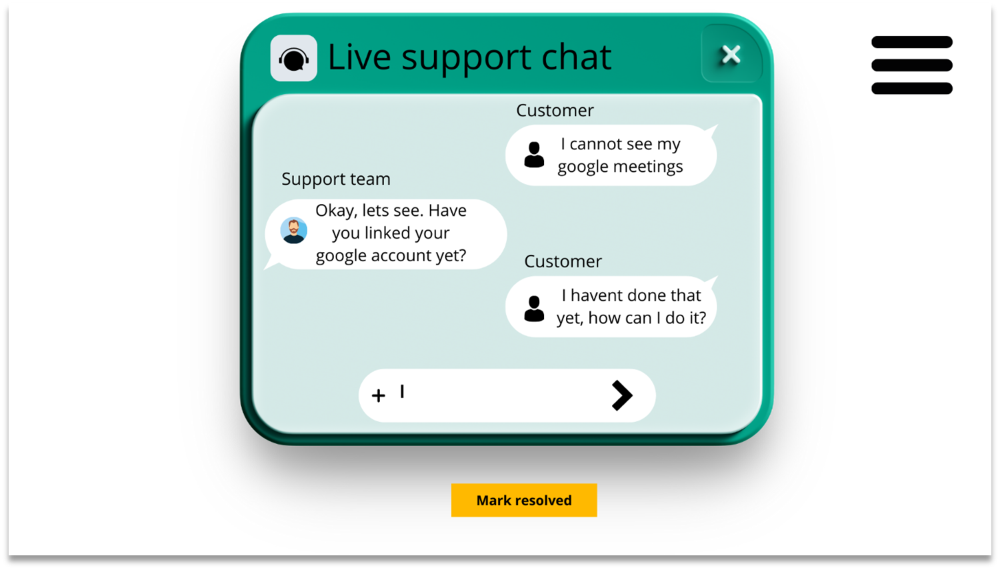
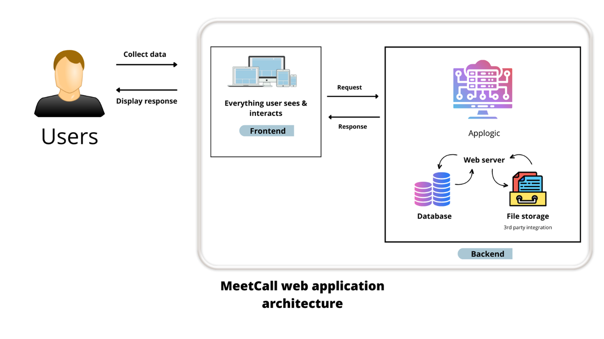

# Software Requirements Specification (SRS)

> SRS for MeetCall - Group 7 Ltd.

> Authors: Aleksanteri Fagerholm, Nico Hartto, Joni Turunen, Simachew Tibebu, Mika Raudaskoski - (Group 18)

## Table of Contents

- [Software Requirements Specification (SRS)](#software-requirements-specification-srs)
  - [Table of Contents](#table-of-contents)
  - [Revision History](#revision-history)
- [Introduction](#introduction)
  - [Purpose](#purpose)
  - [Document Conventions](#document-conventions)
  - [Intended Audience and Reading Suggestions](#intended-audience-and-reading-suggestions)
  - [Product Scope](#product-scope)
  - [References](#references)
- [Overall Description](#overall-description)
  - [Product Perspective](#product-perspective)
  - [Product Functions](#product-functions)
  - [User Classes and Characteristics](#user-classes-and-characteristics)
  - [Operating Environment](#operating-environment)
  - [Design and Implementation Constraints](#design-and-implementation-constraints)
  - [User Documentation](#user-documentation)
  - [Assumptions and Dependencies](#assumptions-and-dependencies)
- [External Interface Requirements](#external-interface-requirements)
  - [User Interfaces](#user-interfaces)
  - [Hardware Interfaces {#hardware-interfaces .list-paragraph}](#hardware-interfaces-hardware-interfaces-list-paragraph)
  - [Software Interfaces](#software-interfaces)
  - [Communications Interfaces](#communications-interfaces)
- [Functional Requirements](#functional-requirements)
- [Feature descriptions](#feature-descriptions)
  - [UCS-3: Recording meetings](#ucs-3-recording-meetings)
    - [Description](#description)
    - [Stimulus/Response Sequences](#stimulusresponse-sequences)
  - [UCS-2: Access meetings through calendar app](#ucs-2-access-meetings-through-calendar-app)
    - [Description](#description-1)
    - [Stimulus/Response Sequences](#stimulusresponse-sequences-1)
  - [UCS-1: Login to meetings via 3rd party authentication providers**](#ucs-1-login-to-meetings-via-3rd-party-authentication-providers)
    - [Description](#description-2)
    - [Stimulus/Response Sequences](#stimulusresponse-sequences-2)
  - [UCS-9: Allow participant entry into meeting](#ucs-9-allow-participant-entry-into-meeting)
    - [Description](#description-3)
    - [Stimulus/Response Sequences](#stimulusresponse-sequences-3)
  - [UCS-4: Share screen to other users in the meeting](#ucs-4-share-screen-to-other-users-in-the-meeting)
    - [Description](#description-4)
    - [Stimulus/Response Sequences](#stimulusresponse-sequences-4)
  - [UCS-10: User can link their accounts and their calendar to MeetCall](#ucs-10-user-can-link-their-accounts-and-their-calendar-to-meetcall)
    - [Description](#description-5)
    - [Stimulus/Response Sequences](#stimulusresponse-sequences-5)
  - [UCS-3: Participants being informed when they are being recorded](#ucs-3-participants-being-informed-when-they-are-being-recorded)
    - [Description](#description-6)
    - [Stimulus/Response Sequences](#stimulusresponse-sequences-6)
  - [UCS-8: Host controls participant's audio](#ucs-8-host-controls-participants-audio)
  - [UCS-5: Meeting host viewing recorded meeting video](#ucs-5-meeting-host-viewing-recorded-meeting-video)
    - [Description](#description-7)
    - [Stimulus/Response Sequences](#stimulusresponse-sequences-7)
  - [UCS-7: Platform provider removes recordings after retention period](#ucs-7-platform-provider-removes-recordings-after-retention-period)
    - [Description](#description-8)
    - [Stimulus/Response Sequences](#stimulusresponse-sequences-8)
- [Non-functional Requirements](#non-functional-requirements)
  - [Performance Requirements](#performance-requirements)
  - [Safety Requirements](#safety-requirements)
  - [Security Requirements](#security-requirements)
  - [Software Quality Attributes](#software-quality-attributes)
- [Appendices](#appendices)
  - [Appendix A: Glossary](#appendix-a-glossary)
  - [Appendix B: Requirements](#appendix-b-requirements)
  - [Appendix C: Pull Requests](#appendix-c-pull-requests)

## Revision History

| **Name**         |**Date**| **Reason For Changes**                      | **Version** |
|------------------|--------|---------------------------------------------|-------------|
| Joni Turunen     | 22.10. | Convert from Teams (docx) to GitHub(md)     |  1.1         |
| RE Team          | 22.10. | Document review & visual details            |  1.0        |
| RE Team          | 20.10. | Peer review and finalizing                  |  0.7        |
| RE Team          | 17.10. | Document review & structural changes        |  0.6        |
| RE Team          | 15.10. | Rotation 3 -- adding content                |  0.5        |
| RE Team          | 13.10. | Document review & changes                   |  0.4        |
| RE Team          | 10.10. | Rotation 1 & 2 -- creating first draft      |  0.3        |
| RE Team          | 08.10. | Deciding content, summary, rotational work  |  0.2        |
| Mika Raudaskoski | 07.10. | Initial document created                    |  0.1        |

---
# Introduction

## Purpose 

The scope of this document is to describe the MeetCall platform's future development, which includes, among others: recording the meeting, viewing the recordings later, deletion due to retention, deletion by customer action and sharing of the meeting recordings (for the participants).

This software requirements specification does not cover the existing MeetCall application in detail, only the new features that will be added in Minimum Viable Product (MVP 2.0-rc1) and later in 2.0 release.

## Document Conventions

This document will not clone all the available documentation outside this document.

Links to external documentation are enclosed in angle-brackets *`< >`* and *italicized*. For other documents, they are listed by filename inside `"`-quotes. There are no other notable typographical conventions or standards that this document follows.

## Intended Audience and Reading Suggestions

This document is written for MeetCall Ltd. and the stakeholders that are directly part of MeetCall Ltd. These stakeholders are the management, development, sales, and marketing teams at MeetCall Ltd.

This document gives an overview of the new features for MVP that involve recording the meetings and viewing them later.

The suggested general reading order is to review the material from the table of contents sequentially. For management, section 2. will be most relevant, and for the development team, sections 2, 3, 4 and 5.

## Product Scope

MeetCall Ltd. has an existing platform, application, that supports reserving calendar spots between businesses (Business-to-Business), businesses and their own customers (Business-to-Customer). Product scope for this SRS and other documentation is to detail the new features that will be added in 2.0 release and the MVP 2.0-rc1 release.

On a high level, it has been identified that recording meetings easily within the application is a feature that will help businesses grow their market by allowing the possibility to review what was agreed upon during the meeting quickly. Such functionality differentiates MeetCall Ltd. from other competing products in the market, which only support the specific platform used, and the recordings are not centrally available for distribution or viewing.

## References

Documentation is tracked and versioned through the Git repository located in GitHub, and the publishing automation is implemented using GitHub Actions (CI/CD). Documentation is available in the versioned format on the web, accessible via the following URLs [https://github.com/lut-re-group18/lut-requirements-engineering](https://github.com/lut-re-group18/lut-requirements-engineering) and [https://lut-re-group18.github.io/lut-requirements-engineering/](https://lut-re-group18.github.io/lut-requirements-engineering/).

# Overall Description

## Product Perspective

The product addressed in this document, MeetCall, will extend the functionality of Group 7 Ltd's core calendar product by enabling customers to attend a meeting virtually, record their session and review them later.

This document specifies the features available in the MeetCall MVP 2.0-rc1 and MeetCall final 2.0 releases.

The latest [Vision & Scope -document](vision-and-scope.md) includes a diagram, [c4-context-diagram.png](imgs/c4-context-diagram.png), that shows the significant relationships of the system.

## Product Functions

To highlight the essential functions of this product, MeetCall allows users to attend Group7's calendar events remotely. MeetCall provides the option to record meetings, and MeetCall can store the meeting recordings for later viewing.

An extensive list of the product functions can be found in a Use Case format and are available on the "Releases"-page in the document titled "use-case.pdf". These are not duplicated here since the up-to-date list is available on the web.

## User Classes and Characteristics

Main user classes for the application have been identified in the initial release of MeetCall, and it is not expected that his classification will change to 2.0-rc1. Additionally, these will not be duplicated in this document for brevity. The reason for this omission is that we have identified that this new feature set will not introduce new user classes and will not change the existing prioritization of those user classes.

## Operating Environment

The existing Group7 platform must peacefully co-exist with the MVP 2.0-rc1 and final release 2.0. This means a certain amount of duplication is required. MeetCall will take some Group7 customers to use the MVP as testers. Finally, the 2.0 release will be gradually available to all customers.

The MeetCall software should be able to operate in Linux environments as a containerized application and not have dependencies on other proprietary licensed software. When and if deployed to a public cloud provider, it is required to be able to run as a containerized application. The meet call software should not need to operate under the same physical or virtual component (server, container) with other software but integrate and communicate via available interfaces.

## Design and Implementation Constraints

The constraints in this project that affect the design can be found in the Vision and Scope document, sections 4.1 and 4.2.

The most significant limitation is the cost that the infrastructure and development can consume. Video transcoding has been identified as a limitation that 3rd party partner will handle.

MeetCall will use the existing tooling that supports the current release, and the target infrastructure platform is either cloud-only or hybrid, depending on the feasibility of those options.

MeetCall must be built to be deployed as a containerized web application that is usable via browser and offers a responsive GUI for mobile use.

All components used by MeetCall, including third-party integrations, must operate geographically in the EU (European Union).

## User Documentation

All requirements engineering documentation will be provided either as PDF --files or via web as PDF --files through the "Releases"-page, resource mentioned in section 1.5. Additional user manual documentation can be agreed upon later and can be provided. A training session for Group7 staff can also be arranged.

## Assumptions and Dependencies

It is assumed that Group 7's "parent application", is in such a condition that it can be extended by the current development team, with the new team members that will be recruited. Group 7's calendar will be used as the platform base for building MeetCall MVP 2.0-rc1 and final release 2.0.

It is assumed that there is existing account handling on parent application, the work done for MVP 2.0-rc1 and 2.0 will continue extending the login functionalities with more login capabilities.

It is assumed that a 3rd party will handle the video transcoding side of the platform. External storage platforms, such as AWS S3, will be used for file storage.

Free and Open-Source Software (FOSS) should be favored when making decisions about frameworks, libraries, software ecosystems etc.

# External Interface Requirements

## User Interfaces

Figure 1 represents the login screen. From here, verified users can sign into the MeetCall application. This view is rebranded sign-in view from the previous version of Group 7's application. They can also sign in with their Google or Microsoft account.

Figure 2 represents the linking view, from which users can link their Google or Microsoft accounts with MeetCall. The linking functionality will allow MeetCall to synchronize the user's calendar with MeetCall's calendar view. The linking view will explain all the terms and conditions that MeetCall has and ensure you are attempting to link the correct email with the account. Pressing the "Agree and link"-button will create the linking and pressing "Cancel" will cancel the linking. On the screen's right-hand side is a hamburger menu that holds all the different views inside.

Figure 3 represents MeetCalls Calendar view. From there, users can see all their synchronised events in their Google and Microsoft calendars.

Figure 4 represents users' view when they book new meetings via the MeetCall calendar. The modal will allow the user to select meeting information. These information fields include title, time, description, attendees, platform, and ability to choose how often the meeting reoccurs.

Figure 5 represents the join meeting functionality. It will appear when the user clicks on an existing meeting; from there, the user can either join the meeting or close the modal.

Figure 6 represents the meeting view, where the user can start the recording, leave the meeting, enable their microphone and camera, or choose additional options. Pressing the "Start recording"-button will begin to record the session, and other users will be advised that the meeting is being recorded.

Figure 7 represents the live support chat view where administrators can support different customers. The admin can send messages via the chat to the users and mark the issue resolved afterwards.

## Hardware Interfaces {#hardware-interfaces .list-paragraph}

The device must use a browser which supports CGI, HTML & JavaScript. The device must be able to connect to internet and for live meetings, it should have a working camera, speakers, and a microphone.

## Software Interfaces
  
| Used                                | Description
| ------------------------------------|---------------------------------------------------------------------------------------------------------------------------------------------------------------------------------------------------------|
| Database                            | Ability to save and maintain the MeetCall user data and content.|
| Front-end                           | Front-end should support ECMAScript 6.|
| Back-end                            | Ability to maintain app logic.|
| File system                         | Recorded meetings are stored into an external video storage platform (3rd party integration).|
| Library                             | Front-end should use some component library so that the developers can save time on building the components. On the long run these components might be wise to integrate to part of the own repository.|
| 3^rd^ party logins                  | 3^rd^ Party logins can be done with Google or with Microsoft account via OAuth 2.0 OIDC.|
| Web server                          | Free and open source (FOSS) software should be used.|
 
 

## Communications Interfaces

MeetCall will be used with Hypertext Transfer Protocol (HTTP) via a browser.

1. A user sends an HTTP request to a web server via the internet using a web browser version of MeetCall's web interface.
2. This opens a TCP channel to the server, and once the channel is open, the HTTP GET request is forwarded by the webserver to the corresponding web application server.
3. The web application server then performs the requested task (in this case user could retrieve their calendar view). The web application server then generates the appropriate results.
4. Results are returned, with the requested information, from the web application server to the web server.
5. The web server then responds to the client side, and the requested payload gets displayed to the user who sent the original request.
6. All communications in and out of MeetCall onto the public network should be SSL-encrypted over HTTPS.
7. All Data at rest and in transit should be encrypted.

---
# Functional Requirements

|  | | | 
| ------------------------|-|-|
|  | | | 
| **Requirement** **ID**  | **Requirement name**         | **Requirement description**|
| REQ-1                   |Ability to access user login  |Users log in with a Unique id and password. Unique ID categorizes every user individually. A unique ID is generated every time when a new user is created. Users can also login with 3rd party authentication.|
| **Release version**     |**Priority**                  |**Verification steps**|
| MVP                     |Must have                     |Login functionality successful Y/N|
| **Requirement status**  |**Reference document**        ||
| Approved                |Github issue [LRE#35](https://github.com/lut-re-group18/lut-requirements-engineering/issues/35)         ||
|  | | | 
| **Requirement** **ID**  | **Requirement name**         | **Requirement description**|
| REQ-2                   |Ability to join meetings from parent applications via link |  Users can join to meetings using parent application. Parent application provides the access and the connection to the third party services meeting.|
| **Release version**     |**Priority**                  | **Verification steps**|
| MVP                     |Must have                     | Connect to a meeting functionality successfully Y/N|
| **Requirement status**  |**Reference document**        ||
| Approved                |Github issues [LRE#25](https://github.com/lut-re-group18/lut-requirements-engineering/issues/25), [LRE#38](https://github.com/lut-re-group18/lut-requirements-engineering/issues/38)||                                                                                                                                                                     
|  | | | 
| **Requirement** **ID**  | **Requirement name**         | **Requirement description**| 
| REQ-3                   | Ability to linking, synchronizing, and managing Google and Microsoft account & calendar | After signing it with their Google or Microsoft account, users can link and synchronize their calendar view. Their users can also manage the calendar views content.|
| **Release version**     |**Priority**                  | **Verification steps**|
| MVP                     |Must have                     | Link and synchronize Google or Microsoft calendar successfully, edit meetings successfully Y/N|
| **Requirement status**  |**Reference document**        ||
| Approved                |Github issue [LRE#36](https://github.com/lut-re-group18/lut-requirements-engineering/issues/36)||
|  | | | 
| **Requirement** **ID**  | **Requirement name**         | **Requirement description**|
| REQ-4                   |Ability to book a new meeting and manage existing meetings (Google & Microsoft calendar)  | After signing users can book new meetings using either of the supported platforms. Users can also manage their existing synchronized meetings.|
| **Release version**     |**Priority**                  | **Verification steps**|
| MVP                     |Must have                     | From the calendar view, user can book a new meeting successfully, edit meetings successfully Y/N|
| **Requirement status**  |**Reference document**        ||
| Approved                |Github issue [LRE#37](https://github.com/lut-re-group18/lut-requirements-engineering/issues/37)||
|  | | | 
| **Requirement** **ID**  | **Requirement name**         | **Requirement description**| 
| REQ-5 | Ability to access core meeting functionality | During the meeting: - Host can press the record button to start recording the meeting. - Users can mute and unmute themselves. - Users can enable camera. - Users can share their screen - Allow/invite participants to enter the meeting - After the meeting - Meeting is stored at 3^rd^ party application storage, where host can watch it afterwards. - Host can decide who has the access to the recording |
| **Release version**    |**Priority**                                  | **Verification steps**|
| MVP                    | Must have                                    | Start recording a meeting successfully, rewatch a recording successfully Y/N|
| **Requirement status** | **Reference document**                       ||
| Approved                |Github issue [LRE#39](https://github.com/lut-re-group18/lut-requirements-engineering/issues/39)||
|  | | | 
| **Requirement** **ID**  | **Requirement name**         | **Requirement description**
| REQ-6                  |  Ability to access support chat   After logging in, user and support personnel need to be able to access the support chat to give and receive help from the support. | 
| **Release version**    |**Priority**                                  | **Verification steps**|
| MVP                    | Must have                                    | User can connect and receive & send messages from support chat successfully, Support personnel can connect and receive & send messages from support chat successfully Y/N|
| **Requirement status** | **Reference document**                       |                                                                                               |
| Approved                |Github issue [LRE#40](https://github.com/lut-re-group18/lut-requirements-engineering/issues/40)                                               ||
  

---
# Feature descriptions

System features are organized in prioritized list of use cases in this topic. Most important features are listed first. Use cases and parts of the use cases specifications have been added to represent the required system features.

Prioritization has been done using MSCW scale:

1.  **M**ust have
2.  **S**hould have
3.  **C**ould have
4.  **W**on't have

The last category's (C & W) use cases are not presented in the SRS documentation.

## UCS-3: Recording meetings

Use case: As a host, I want to record the meeting, so recording is available for participants later.

### Description

Key new business feature for MeetCall, the ability to record meetings therefore this is prioritized as **'must have'**.

### Stimulus/Response Sequences

| **Step**| **User Actions**| **System Actions**| 
| ------------------------|-|-|
|1|Meeting host presses "record"|Recording is started|
|2||Meeting participants are notified that the meeting is being recorded|
|3|Meeting is ended/host presses "stop recording"|Meeting recording is stopped|

## UCS-2: Access meetings through calendar app

Use case: As a user, I want to join meetings via calendar app so that I can join meetings without opening another app.

### Description

Participants should be able to join the meetings via the calendar application without logging to separate service. User experience is important and should be seamless. The feature is prioritized at the top of the system features and categorized as **'must have'**.

### Stimulus/Response Sequences

| **Step**| **User Actions**| **System Actions**| 
| ------------------------|-|-|
|1|Join the meeting|System joins user selected meeting|

## UCS-1: Login to meetings via 3rd party authentication providers**

Use case: As a user, I want to be able to use my existing 3rd party authentication provider so that I can use my existing credentials to sign in.

### Description

Related to UCS-2 the login experience should be as seamless as possible to promote good user experience to meeting platform in general and therefore is prioritized as **'must have'**.

### Stimulus/Response Sequences

| **Step**| **User Actions**| **System Actions**| 
| ------------------------|-|-|
|1|Makes a request to MeetCall|A valid session is required|
|2|Selects auth provider login|Accepts credentials and logs user in|

## UCS-9: Allow participant entry into meeting

Use case: As a host, I want to control who I let in the meeting so that I can moderate the meeting.

### Description

To achieve good user experience for all the meeting users (host and attendees) it is important that the meeting is safe even if the meeting event link has leaked to unknown or malicious users. Unwanted entries would nullify the value of the meeting and therefore this feature is a **'must have'**.

### Stimulus/Response Sequences

| **Step**| **User Actions**| **System Actions**| 
| ------------------------|-|-|
|1|Meeting host joins a meeting.|The system notifies the host how many participants are waiting in the lobby|
|2|Meeting host allows participants one by one into the meeting from the lobby.|The system adds the participant into the meeting.|
|3|A participant tries to join a meeting|The system notifies the participant to wait in the lobby. The system notifies the meeting host a participant wants to join the meeting.|
|4|The meeting host allows the participant into the meeting.|The system adds the participant from the meeting.|

## UCS-4: Share screen to other users in the meeting

Use case: As a host, I want to control who I let in the meeting so that I can moderate the meeting.

### Description

Our requirement's engineering work has identified the screen sharing feature as an important part of the meeting. Without sharing functionality, the meeting lacks value to attendees and would not reach the core reason for having valuable business meeting. Functionality and the value generated by the meeting would be limited without screen share capabilities and therefore the prioritization is **'must have'**.

### Stimulus/Response Sequences

| **Step**| **User Actions**| **System Actions**| 
| ------------------------|-|-|
|1|Makes request to share screen|Ask which screen to share|
|2|Selects desired screen|Selected screen is visible to attendees|
|3|Stops sharing|Screen sharing is stopped|

## UCS-10: User can link their accounts and their calendar to MeetCall

**User can link their Google & Microsoft accounts and their calendar with the application**

Use case: As a user, I want to be able to synchronize my Google and Microsoft calendar, so that I see all my meetings inside the MeetCall calendar.

### Description

Use case is important for the platform user and affects the usability of the platform. Missing this feature is inconvenient and lowers the value of application and therefore is prioritized as **must have'**.

### Stimulus/Response Sequences

| **Step**| **User Actions**| **System Actions**| 
| ------------------------|-|-|
|1|User clicks to link their account|System acknowledges this, and offers the information about linking their Google account with MeetCall|
|2|User accepts the linking|System links the users Google account and synchronizes the calendar|

## UCS-3: Participants being informed when they are being recorded

Use case: As a user, I want to be automatically notified when a meeting is being recorded.

### Description

The information about the fact of being recorded is important to the attendees and might affect how they present themselves. It is also a privacy concern. Missing this feature would require host guidance and user manual documentation about the need to let the attendees know when the recording is activated. Since there is a workaround solution that would lower the user experience, the feature is prioritized as a **'should have'**.

### Stimulus/Response Sequences

| **Step**| **User Actions**| **System Actions**| 
| ------------------------|-|-|
|1|Host starts recording|System informs participants|
|2|User accepts|Continue meeting|

## UCS-8: Host controls participant's audio 

Use case: As a host, I want to control a meeting participant's audio so that I can moderate the meeting.

4.3.1 Description

For bigger meetings, there is clear need identified for the control of attendees to prevent accidental open microphones or camera feeds interrupting presentations. The host should have control over the inputs of attendees to administer the meeting so that the attendees can have a good experience. Missing this feature would require work around from the host to ask attendees to mute microphones and disable video cameras and for those reasons the feature is considered as **'should have'**.

4.3.2 Stimulus/Response Sequences

| **Step**| **User Actions**| **System Actions**| 
| ------------------------|-|-|
|1|Meeting host presses the microphone button of a participant.|The system toggles the mute state of the participant's microphone.|

## UCS-5: Meeting host viewing recorded meeting video

Use case: As a host, I want to view the recording from the meeting, so that I can easily review what was said and agreed upon.

### Description

Viewing the recordings should be available for invited attendees. This feature will give value in several ways to attendees. For example, checking facts from held meeting. Missing this feature is inconvenient but won't lower the value of the live meeting and therefore is prioritized as **'should have'**.

### Stimulus/Response Sequences

| **Step**| **User Actions**| **System Actions**| 
| ------------------------|-|-|
|1|Meeting host opens up the meeting recording|Playback is started|

> Use case UCS-5 is related strongly to UCS-3.

> REQ-X relates to this

## UCS-7: Platform provider removes recordings after retention period

Use case: As a platform provider, I want remove recordings after data retention period, so that no data is unnecessarily retained. GDPR (General Data Protection Regulation).

### Description

Use case is important for the platform owner and affects the cost structure of the platform. However, the use case does not affect end-users' experience and therefore it has been given '**could have'** prioritization.

### Stimulus/Response Sequences

| **Step**| **User Actions**| **System Actions**| 
| ------------------------|-|-|
|1|Customer cancels their account|System acknowledges this, informs customer that data will be kept for 365 days but no longer|

---
# Non-functional Requirements

A table of all requirements with a classification between non-functional and functional requirements and the notion of architecturally significant requirements are listed in Appendix B.

The following description of non-functional requirements refers to this table (appendix b) requirement identifiers with a prefix of '#'.

## Performance Requirements

The calendar and meeting app should work without significant latency. The application also should be as light as possible, meaning that the application must also work on standard household computers with limited RAM and CPU power. That is a computer that meets the system requirements to run a modern web browser.

Meetings must also have video quality equal to or greater than 720p, and audio recording must be recorded with quality equal to or greater than 96 kbps.

The platform is required to deliver functionality promptly. This includes opening recorded meetings (#22), video (#31) and audio (#32) quality targets, as well as the general response of the system to user actions (#27).

## Safety Requirements

Group7 Ltd has already a calendar app to which users already have login information. This additional functionality is then implemented on top of this, so user safety is already dealt with their old product. MeetCall login functionalities will extend this existing login system.

## Security Requirements

The application collects personal data and stores this data; therefore, GDPR rules must be fulfilled.

Participating in a meeting shall be only possible with an invitation. If someone else (not the host) invites people to the meeting, the host must acknowledge these participants when they join. This includes Legality: GDPR must be followed (#24).

The application also must log user events (#28) to allow developers to analyze user actions and troubleshoot if there are any problems with the application.

## Software Quality Attributes

Software must be as user-friendly as possible. This means that the usability of the software should be measured through Average time on task, Task completion rate, Error occurrence rate, Adaption rate and Retention rate. During the software development a survey of system usability scale should be completed with using a focus group.

Maximum response time for most major functionalities and interactions, the p95 (percentile) should be under 300ms.

On the server side, actions should be completed in less than 300ms (p95). This excludes the time it takes to transcode and store video of the meetings.

Transcoding and storing varies based on the meeting length, but at most this should be done in 24 hours and the customer would be notified when the recording is ready via in-app notification or via other communication methods available, in 30 minutes after the work competition.

Availability of the service. Service can tolerate small service breaks: Availability during the peak usage period should be so that no break exceeds 2 minutes in length. During off-peak hours, the service breaks can be longer, with up to 30 minutes of unavailability per month.

Persistence should be handled so that it matches the availability of 99,99% of e.g., AWS S3 and similarly the durability of AWS S3 Standard (99,999999999%). As such, it is recommended that the persistence is handled by 3rd party and not done in-house.

---

# Appendices
## Appendix A: Glossary

AWS -- Amazon Web Services, cloud platform provider.
FOSS -- Free and Open-Source Software.
GDPR -- General Data Protection Regulation.
GUI -- Graphical User Interface.
HTML -- HyperText Markup Language.
HTTP -- Hypertext Transfer Protocol.
HTTPS -- Hypertext Transfer Protocol Secure. HTTP protocol in combination with TLS/SSL protocols.
MSCW -- Prioritization method. Must have, should have, could have, won't have.
MVP -- Minimum Viable Product.
SRS -- Software Requirements Specification. Example this document.
SSL -- Secure Sockets Layer
TLS -- Transport Layer Security (TLS). Follower for SSL protocol.
UCS -- Use Case Specification.
URL -- Uniform Resource Locator, e.g., a web page address (for example, <https://google.fi>).

## Appendix B: Requirements

[Dynamic list of requirements](https://github.com/lut-re-group18/lut-requirements-engineering/issues) with filters can be viewed at GitHub.

|**#**|**title**|**types**|
|:-|:-|:-|
|[42](https://github.com/lut-re-group18/lut-requirements-engineering/issues/42)|Require the dependencies to be FOSS|Non-functional, ASR|
|[40](https://github.com/lut-re-group18/lut-requirements-engineering/issues/40)|Ability to access support chat|Functional|
|[39](https://github.com/lut-re-group18/lut-requirements-engineering/issues/39)|Ability to access core meeting functionality|Functional, ASR|
|[38](https://github.com/lut-re-group18/lut-requirements-engineering/issues/38)|Join a meeting|Functional, ASR|
|[37](https://github.com/lut-re-group18/lut-requirements-engineering/issues/37)|Ability to book a new meeting and manage existing meetings (Google & Microsoft calendar)|Functional|
|[36](https://github.com/lut-re-group18/lut-requirements-engineering/issues/36)|Ability to linking and synchronizing Google and Microsoft account & calendar|Functional|
|[35](https://github.com/lut-re-group18/lut-requirements-engineering/issues/35)|Ability to access user login|Functional, ASR|
|[33](https://github.com/lut-re-group18/lut-requirements-engineering/issues/33)|Host of the meeting should be able to select how long the recording is available for the end-users to watch online|Functional|
|[32](https://github.com/lut-re-group18/lut-requirements-engineering/issues/32)|Host of the meeting should be able to select if the recording is downloadable to attendees|Functional|
|[31](https://github.com/lut-re-group18/lut-requirements-engineering/issues/31)|The video quality of meeting recordings should be equal to or better than 720p|Non-functional, ASR|
|[30](https://github.com/lut-re-group18/lut-requirements-engineering/issues/30)|The audio quality of meeting recordings should be equal to or better than 96 kbps|Non-functional, ASR|
|[29](https://github.com/lut-re-group18/lut-requirements-engineering/issues/29)|Visually impaired users should be able to join meetings|Functional, ASR|
|[28](https://github.com/lut-re-group18/lut-requirements-engineering/issues/28)|System should log user events|Non-functional|
|[27](https://github.com/lut-re-group18/lut-requirements-engineering/issues/27)|Performance: Response time for interactions in major features should be under 300ms (TM95)|Non-functional, ASR|
|[25](https://github.com/lut-re-group18/lut-requirements-engineering/issues/25)|Ability to join meetings from parent applications via link|Functional|
|[24](https://github.com/lut-re-group18/lut-requirements-engineering/issues/24)|Legality: GDPR must be followed|Non-functional, ASR|
|[23](https://github.com/lut-re-group18/lut-requirements-engineering/issues/23)|Portability: Date time should use ISO 8601 format|Non-functional|
|[22](https://github.com/lut-re-group18/lut-requirements-engineering/issues/22)|Less than 800ms response for opening recorded meetings|Non-functional, ASR|

## Appendix C: Pull Requests

[Dynamic list of Pull Requests](https://github.com/lut-re-group18/lut-requirements-engineering/pulls?q=is%3Apr+is%3Aall) with discussions can be viewed at GitHub.

|**#**|**title**|**from branch**|
|:-|:-|:-|
|48|remove use-cases.md checklists section|review-cleanup|
|47|Finalize documents|finalize-documents|
|46|Move process and workflow descriptions to ch.2|Add-reference-to-guide-of-generate-appendices|
|45|Modify requirements management plan and add traceability table|modify-appendices-in-plan|
|44|Add requirements table for Appendix A, add information about creating appendices|docs-about-extracting-issues|
|43|Add generic use-case diagram|additions-from-teams-review|
|41|Fix: Forgot to add version info for the last PR|update-version-history|
|34|added usc-10|feature/link-google-and-microsoft-accounts|
|26|fixing login feature tracability|main_loginfix|
|21|Add US-6 "as a host I want to record the meeting"|add-us-6-as-a-host-i-want-to-record-the-meeting|
|20|amend US-5 and US-7|fix-us5-and-us7|
|18|Update management plan|update-management-plan|
|17|Order of use cases|order-of-use-cases|
|16|Fixing typos and visual thingies|Fixing-typos-and-visual-thingies|
|15|Add separate ordered list|add-ordered-list-off-use-cases|
|14|feat add support for marings (LUT specific)|lut-template-borders-for-pandoc|
|13|USC-7 platform provider remove recordings after retention period|usc-7-platform-provider-remove-recordings-after-retention-period|
|12|Pages links|pages-links|
|11|add the use cases into the list|usc-8|
|10|improve use case 9|usc-9|
|9|adds use case 8|usc-8|
|8|adds use case 9|usc-9|
|7|Tweaks for recorded meeting document|tweaks-for-recorded-meeting-document|
|6|Meeting changes|meeting-changes|
|5|add UCS-5 about viewing recordings|ucs-5-host-viewing-recording-of-meeting|
|4|First stories and specifications|first-stories-and-specifications|
|3|Fix url to main branch|Fix-c4-img|
|2|Use case draft docs|use-case-draft|
|1|URLs need fixing|fix-issue-link|
  
---

[Return to main documentation page](../README.md)