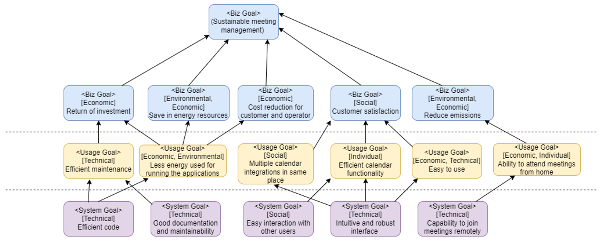
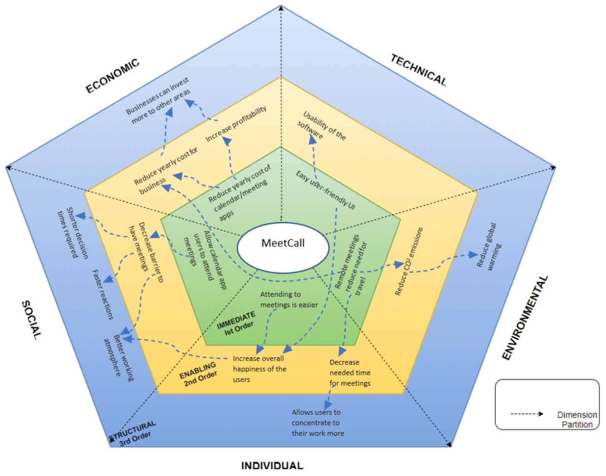

# Sustainability Analysis of Requirements Specification (SAoRS)

> SAoRS for MeetCall - Group 7 Ltd.

> Authors: Aleksanteri Fagerholm, Nico Hartto, Joni Turunen, Simachew Tibebu, Mika Raudaskoski | Group 18

## Table of Contents

- [Sustainability Analysis of Requirements Specification (SAoRS)](#sustainability-analysis-of-requirements-specification-saors)
  - [Table of Contents](#table-of-contents)
  - [Revision History](#revision-history)
- [Introduction](#introduction)
  - [Purpose](#purpose)
- [Framework for Sustainability of Software System Design (FSSSD)](#framework-for-sustainability-of-software-system-design-fsssd)
- [Goal Model](#goal-model)
- [Sustainability Requirement Template](#sustainability-requirement-template)
- [Requirements Sustainability Analysis Radar Chart](#requirements-sustainability-analysis-radar-chart)

## Revision History

| **Name**         |**Date**| **Reason For Changes**                      | **Version** |
|------------------|--------|---------------------------------------------|-------------|
| Joni Turunen     | 22.10.2022 | Convert from Teams (docx) to GitHub(md)| 1.2 |
| RE Team          | 22.10.2022 | Document review & changes| 1.1|
| RE Team          | 21.10.2022 | Finalizing document| 0.9|
| RE Team          | 16.10.2022 | Document review & changes Adding sustainability requirement template| 0.8|
| Mika Raudaskoski | 12.10.2022 | Document created| 0.2|

---
# Introduction

## Purpose 

The purpose of this document is to give an overview of the sustainability approach that MeetCall will use. MeetCall meets the increased need for remote meetings, which are a more sustainable alternative to in-person meetings if the distances are long. Similarly, MeetCall thinks about software sustainability in the way that it enables long-lasting architecture that can be evolved in the future and built upon.

With sustainability, we want to ensure the system will outlast its developers. It is required that the architectural design and software development process consider things like technical debt and best programming practices to facilitate the maintainability of the software project. Keeping sustainability as a design principle will guide the project towards these goals.

Group 7 Ltd's original calendar application will be extended with the remote meeting and meeting recording functionality which will add the business value that Group 7 Ltd is looking for, the business goal. These releases are referred to as MVP 2.0-rc1, which will fulfil the first subset of features outlined in the SRS document. Additionally, MVP will be followed by the feature-complete version of 2.0 later.

# Framework for Sustainability of Software System Design (FSSSD)

| SDLC Phases and Karlskrona Manifesto Principles | Sustainability   Goals | Sustainability   Concepts, Methods and Tools  | Indicators   /Measure / Metric  |
|---|---|---|---|
| **Phase 1.** Project Definition     - Provide a platform in which the users can   host, attend, and record their 3rd party hosted meetings.      - Design an intuitive UI for the users to navigate inside the application. | Design for:      Maintainability, Reusability, Robustness, Pleasant development timelines | Agile development, Cradle to cradle in a way   where in the future, other 3rd party calendar apps could be integrated to the   system | Development timelines meet the planned   timelines.      Developers CSAT scores are aligned with good indicators. |
| **Phase 2.** User   Requirements Definition      - The MeetCall application should be accessible online via web browser     - Provide calendar integration for Google and   Microsoft.     - Allow user to join, host, record and rewatch   meetings. | Reduce development cost, increase   efficiency | Sustainability requirement   Template | How efficient is operating all the   calendar events that the user has? |
| **Phase 3.** System Requirements Definition     - Synchronise all user’s 3rd party meetings to   the MeetCall application.     - Allow users to record and rewatch meetings   later from 3rd party video storage.     - Allow creation, deletion, updating and reading   of meetings that are synchronised in the calendar.      - Provide means for support team to offer help to users with the software. | Modularity, cohesion, separation   of concerns, and loose coupling | Social and technical dimension of   sustainability | How satisfied are the users of accessing   their meetings with the application?      Do users use the recording and view later functionality, and does it help   them to regain insights from the meeting?      How many hours from development work went under the timeline?  |

# Goal Model

Figure 1 - Sustainability Goal Model

# Sustainability Requirement Template

| Requirement | Sustainability   Dimension | Explanation |
|---|---|---|
| User can attend a calendar event online   remotely. | Economic Social Environmental | – This   requirement enables the user to save time and money that would otherwise   would have been spent during the travel to and from the physical location of   the meeting. Hence the inclusion of Economic dimension. – This requirement also enables those users who are not able to attend the meetings physically for a variety of reasons (health, economical, lack of   time, or must care for another person at home) to attend the meetings and thus increasing their interaction. – Because users avoid the otherwise needed travel the system contributes to decreasing CO2 emission |
| The platform is required to deliver functionality in a timely   manner | Economic | – This   requirement helps the system to avoid wasting time, which is a resource that   has monetary value. |
| The system should be available 99,99% of the time. | Economic Individual | – This   requirement as well enables the system to avoid wasting time. – This requirement also guarantees individuals the availability of service   to them |
| Video transcoding and encoding is done outside   of Group 7 Ltd’s systems via 3rd party. | Economic Environmental | – This enables the computation to happen during cheaper / off-peak   hours. – 3rd party will handle the encoding and transcoding in an efficient way. |
| As a host, I want to record the meeting, so recording is available   for later viewing | Individual | – Recorded and   stored meetings store important knowledge for all the individuals that were   involved in the meeting. This requirement maintains human capital of   knowledge on the individual level. |
| As a user, I want to be notified when a meeting is being recorded. | Individual | – This   requirement also maintains human capital from the perspective of safety. In   addition, it also enables individuals to exercise their rights to not be   recorded, for example, by exiting a meeting where a recording will be made   of. |
| Platform provider removes meeting recordings after retention   period | Economic Environmental | – Economy   because the increasing amount of storage is adding costs. – The more storage a system continues to use, the more it affects natural   resources such as air and water negatively due to its energy demands.  |

# Requirements Sustainability Analysis Radar Chart

Figure 2 - Analysis radar chart
