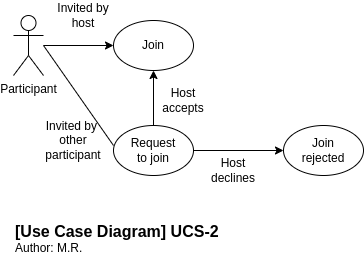
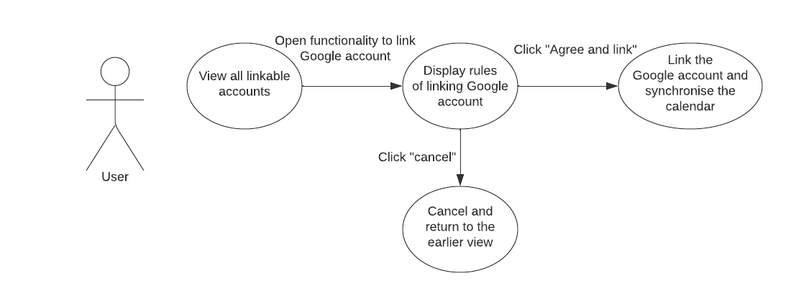

# Use Case Document

> Document authors:
> Nico Hartto, Mika Raudaskoski, Aleksanteri Fagerholm, Simachew Tibebu, Joni Turunen

> Draft created 3.10.2022
> Last updated 22.10.2022
> Version 1.4 (Final) - Change history in GitHub repository

---

## Table of Contents

- [Use Case Document](#use-case-document)
  - [Table of Contents](#table-of-contents)
  - [Use case specification template](#use-case-specification-template)
    - [Use Case Diagram](#use-case-diagram)
    - [User stories](#user-stories)
    - [Use Case Specification](#use-case-specification)
  - [Use case specific checks](#use-case-specific-checks)
    - [Use Case Diagram](#use-case-diagram-1)
    - [Actors](#actors)
    - [Use Case Specifications](#use-case-specifications)
- [Use Case: ucs-1-login.md](#use-case-ucs-1-login-md)
- [Use Case: ucs-2-access-through-app.md](#use-case-ucs-2-access-through-app-md)
- [Use Case: ucs-3-being-recorded.md](#use-case-ucs-3-being-recorded-md)
- [Use Case: ucs-4-screensharing.md](#use-case-ucs-4-screensharing-md)
- [Use Case: ucs-5-host-viewing-recording-of-meeting.md](#use-case-ucs-5-host-viewing-recording-of-meeting-md)
- [Use Case: ucs-6-host-record-meeting.md](#use-case-ucs-6-host-record-meeting-md)
- [Use Case: usc-7-platform-provider-remove-recordings-after-retention-period.md](#use-case-usc-7-platform-provider-remove-recordings-after-retention-period-md)
- [Use Case: usc-8-host-control-participant-audio.md](#use-case-usc-8-host-control-participant-audio-md)
- [Use Case: usc-9-allow-participant-entry-to-meeting.md](#use-case-usc-9-allow-participant-entry-to-meeting-md)
- [Use Case: ucs-10-linking-and-synchronising-calendar.md](#use-case-ucs-10-linking-and-synchronising-calendar-md)

---

## Use case specification template

Use case specifications are written in markdown and stored in the `docs/use-cases` folder. The [template for the use case specification](./use-cases/ucs-template.md) is in the `docs/use-cases/ucs-template.md` file.

Use cases are presented via GitHub pages at [https://lut-re-group18.github.io/lut-requirements-engineering/docs/use-cases.html](https://lut-re-group18.github.io/lut-requirements-engineering/docs/use-cases.html). Final deliverable is a PDF document that is generated from the markdown files and submitted to Moodle.

### Use Case Diagram

Use case diagram shows the actors and the main use cases of the system.


### User stories

Template for user stories start with a identifier **tag** followed by user **role** and a story written in 'I want' and 'so that' statements.

```markdown
us-19: As [a user persona], I want [to perform this action] so that [I can accomplish this goal].
```

Table of use cases are prioritized in the order of importance using the MoSCoW scale. The use case specifications are linked to the user stories in the table. Scale consists of four categories: **M**ust have, **S**hould have, **C**ould have and **W**on't have.

| #   | User Story ID                                                                         | User Story                                                                                                                             | Author | MSCW   |
| --- | ------------------------------------------------------------------------------------- | -------------------------------------------------------------------------------------------------------------------------------------- | ------ | ------ |
| 01  | [us-6](#use-case-ucs-6-host-record-meeting-md)                                        | As a **host**, I want to record the meeting so recording is available for participants later.                                          | NH     | Must   |
| 02  | [us-2](#use-case-ucs-2-access-through-app-md)                                         | As a **user**, I want to join meetings via calendar app so that I can join meetings without opening the app.                           | MR     | Must   |
| 03  | [us-1](#use-case-ucs-1-login-md)                                                      | As a **user**, I want to be able to use my existing 3rd party authentication provider so that I can use my existing credentials to in. | JT     | Must   |
| 04  | [us-9](#use-case-usc-9-allow-participant-entry-to-meeting-md)                         | As a **host**, I want to control who I let in the meeting so that I can moderate the meeting.                                          | ST     | Must   |
| 05  | [us-4](#use-case-ucs-4-screensharing-md)                                              | As a **host**, I want to share my screen in the meetings, so that attendees can view my presentation.                                  | JT     | Must   |
| 06  | [us-3](#use-case-ucs-3-being-recorded-md)                                             | As a **user**, I want to be automatically notified about recording of the meeting.                                                     | MR     | Should |
| 07  | [us-8](#use-case-usc-8-host-control-participant-audio-md)                             | As a **host**, I want to control a meeting participant's audio so that I can moderate the meeting.                                     | ST     | Should |
| 08  | [us-5](#use-case-ucs-5-host-viewing-recording-of-meeting-md)                          | As a **host**, I want to view the recording from the meeting, so that I can easily review what was said and agreed upon.               | NH, AF | Should |
| 09  | [us-7](#use-case-usc-7-platform-provider-remove-recordings-after-retention-period-md) | As a **platform provider**, I want remove recordings after data retention period, so that no data is unnecessarily retained (GDPR).    | NH     | Could  |

### Use Case Specification

Naming convention for the UCSs is present in the file names `./use-cases/ucs-<number>-<use-case-name>.md` in the docs folder.

For example `ucs-1-login.md`.

---

# Use Case: ucs-1-login-md

## Use Case Identification and History

| **Use Case ID**         | ucs-1-login.md                                                 |
| ----------------------- | -------------------------------------------------------------- |
| **Use Case Name**       | Login to meetings via 3rd party authentication providers       |
| **Related User Story**  | us-1                                                           |
| **End Objective**       | User logs in with existing credentials from 3rd party provider |
| **Creator & time**      | Joni Turunen 6.10.2022                                         |
| **Last Updater & time** |                                                                |
| **Approver & time**     |                                                                |
| **User/Actor**          | Meeting host and participants                                  |
| **Business Owner Name** |                                                                |
| **Trigger:**            | Accessing meeting platform                                     |
| **Frequency of Use:**   | Login required for all use cases                               |

## Preconditions

User has a 3rd party account

## Basic Flow

| **Step** | **User Actions**            | **System Actions**                   |
| -------- | --------------------------- | ------------------------------------ |
| 1        | Makes a request to MeetCall | A valid session is required          |
| 2        | Selects auth provider login | Accepts credentials and logs user in |

## Alternate Flows

| **Step** | **User Actions**                   | **System Actions**                          |
| -------- | ---------------------------------- | ------------------------------------------- |
| 1        | BF.2: User selects to create login | Registeration page displayed                |
| 2        | Complete registeration             | New login credentialls are created for user |

## Exception Flow

| **Step** | **User Actions**                | **System Actions**                |
| -------- | ------------------------------- | --------------------------------- |
| 1        | BF.2: User selects manual login | Login screen showed               |
| 2        | User provides credentials       | Manual login is checked           |
| 3        |                                 | Outcome of login attempt is shown |

## Post Conditions

User can access the MeetCall platform and use it's features.

## Includes or Extension Points

n/a

## Special Requirements

n/a

## Business rules

User logins are part of MeetCall audit trail.

## Other Notes (Assumptions, Issues, etc.)

n/a

---

# Use Case: ucs-2-access-through-app-md



## Use Case Identification and History

| **Use Case ID**         | ucs-2-access-through-app.md                 |
| ----------------------- | ------------------------------------------- |
| **Use Case Name**       | Access meetings through calendar appears    |
| **Related User Story**  | us-2                                        |
| **End Objective**       | Participants can join from calendar appears |
| **Creator & time**      | Mika Raudaskoski 5.10.2022                  |
| **Last Updater & time** | Nico Hartto 22.10.2022                      |
| **Approver & time**     |                                             |
| **User/Actor**          | Meeting participants                        |
| **Business Owner Name** |                                             |
| **Trigger:**            | Meeting participant                         |
| **Frequency of Use:**   | Every time he/she wants to attend meeting   |

## Preconditions

User has calendar app open and user has invitation for meeting

## Basic Flow

| **Step** | **User Actions** | **System Actions**             |
| -------- | ---------------- | ------------------------------ |
| 1        | Join the meeting | System joins to wanted meeting |

## Alternate Flows

| **Step** | **User Actions**    | **System Actions**             |
| -------- | ------------------- | ------------------------------ |
| 1        | Join the meeting    | System sends request for host  |
| 1        | Host accept request | System joins to wanted meeting |

## Exception Flow

| **Step** | **User Actions** | **System Actions**                         |
| -------- | ---------------- | ------------------------------------------ |
| 1        | Join the meeting | Invitation link invalid give error message |

## Post Conditions

Meeting participant is successfully joined the meeting from calendar app

## Includes or Extension Points

## Special Requirements

Only invited persons can join/send join request to meeting.

## Business rules

If person is invited to meeting by host he doesn't need to ask request from host at the beginning of the meeting.

## Other Notes (Assumptions, Issues, etc.)

n/a

---

# Use Case: ucs-3-being-recorded-md


## Use Case Identification and History

| **Use Case ID**         | ucs-3-being-recorded.md                                          |
| ----------------------- | ---------------------------------------------------------------- |
| **Use Case Name**       | Participants being informed when they are being recorded         |
| **Related User Story**  |                                                                  |
| **End Objective**       | Participants get informed that they are recorded                 |
| **Creator & time**      | Mika Raudaskoski 4.10.2022                                       |
| **Last Updater & time** | Nico Hartto 22.10.2022                                           |
| **Approver & time**     |                                                                  |
| **User/Actor**          | Meeting host and participants                                    |
| **Business Owner Name** |                                                                  |
| **Trigger:**            | Meeting Host activates recording and system informs participants |
| **Frequency of Use:**   | Every time new recording is started                              |

## Preconditions

Meeting is running

## Basic Flow

| **Step** | **User Actions**      | **System Actions**          |
| -------- | --------------------- | --------------------------- |
| 1        | Host starts recording | System informs participants |
| 2        | User accepts          | Continue meeting            |

## Alternate Flows

| **Step** | **User Actions**        | **System Actions**          |
| -------- | ----------------------- | --------------------------- |
| 1        | Host starts recording   | System informs participants |
| 2        | Waiting for acknowledge | Wait until acknowledged     |

## Exception Flow

| **Step** | **User Actions**      | **System Actions**          |
| -------- | --------------------- | --------------------------- |
| 1        | Host starts recording | System informs participants |
| 2        | No acknowledgedment   | Wait                        |

## Post Conditions

Participant can continue in meeting.

## Includes or Extension Points

## Special Requirements

All users in the meeting shall know if he/she is recorded. This is legal action.

## Business rules

When user accepts that he/she is being recorded recordings can be saved normally.

## Other Notes (Assumptions, Issues, etc.)

n/a

---

# Use Case: ucs-4-screensharing-md

## Use Case Identification and History

| **Use Case ID**         | ucs-4-screensharing.md                                           |
| ----------------------- | ---------------------------------------------------------------- |
| **Use Case Name**       | Share screen to other users in the meeting                       |
| **Related User Story**  | us-4                                                             |
| **End Objective**       | During the meeting host's screen is visible to meeting attendees |
| **Creator & time**      | Joni Turunen 6.10.2022                                           |
| **Last Updater & time** | Nico Hartto 22.10.2022                                           |
| **Approver & time**     |                                                                  |
| **User/Actor**          | Meeting host/presentator                                         |
| **Business Owner Name** |                                                                  |
| **Trigger:**            | Host enables screen sharing from his device                      |
| **Frequency of Use:**   | Everytime host(s) want to share their screen                     |

## Preconditions

Meeting is running.

## Basic Flow

| **Step** | **User Actions**              | **System Actions**                      |
| -------- | ----------------------------- | --------------------------------------- |
| 1        | Makes request to share screen | Ask which screen to share               |
| 2        | Selects desired screen        | Selected screen is visible to attendees |
| 3        | Stops sharing                 | Screen sharing is stopped               |

## Alternate Flows

| **Step** | **User Actions**                    | **System Actions**                  |
| -------- | ----------------------------------- | ----------------------------------- |
| 1        | BF.2: Host cancels screen selection | Screen sharing functionality closes |

## Exception Flow

| **Step** | **User Actions**                | **System Actions**                       |
| -------- | ------------------------------- | ---------------------------------------- |
| 1        | BF.1: Starts screen share func. | Poor network connection detected         |
| 2        |                                 | Host is informed about poor connectivity |
| 3        |                                 | Prompt to end the share is displayed     |
| 4        | Selects to resume or cancel     | Continue normal flow                     |

## Post Conditions

Screen share is visible to all attendees and added to recording.

## Includes or Extension Points

[ucs-3](use-cases/ucs-3-being-recorded.md)

## Special Requirements

n/a

## Business rules

n/a

## Other Notes (Assumptions, Issues, etc.)

n/a

---

# Use Case: ucs-5-host-viewing-recording-of-meeting-md


## Use Case Identification and History

| **Use Case ID**         | ucs-5-host-viewing-recording-of-meeting.md                     |
| ----------------------- | -------------------------------------------------------------- |
| **Use Case Name**       | Meeting host viewing recorded meeting video                    |
| **Related User Story**  |                                                                |
| **End Objective**       | View the recording afterwards, to recap what was said          |
| **Creator & time**      | Nico Hartto, Aleksanteri Fagerholm 6.10.2022                   |
| **Last Updater & time** |                                                                |
| **Approver & time**     |                                                                |
| **User/Actor**          | Meeting host                                                   |
| **Business Owner Name** |                                                                |
| **Trigger:**            | Host opens up the recorded meeting on his/hers app for viewing |
| **Frequency of Use:**   | Everytime host views a recorded meeting                        |

## Preconditions

Meeting has been successfully recorded.

## Basic Flow

| **Step** | **User Actions**                            | **System Actions**  |
| -------- | ------------------------------------------- | ------------------- |
| 1        | Meeting host opens up the meeting recording | Playback is started |

## Alternate Flows

| **Step** | **User Actions**                                  | **System Actions**               |
| -------- | ------------------------------------------------- | -------------------------------- |
| 1        | Meeting host cancels the viewing of the recording | Playback of recording is stopped |

| **Step** | **User Actions**                                 | **System Actions**              |
| -------- | ------------------------------------------------ | ------------------------------- |
| 1        | Meeting host pauses the viewing of the recording | Playback of recording is paused |

## Exception Flow

| **Step** | **User Actions**                            | **System Actions**                      |
| -------- | ------------------------------------------- | --------------------------------------- |
| 1        | Meeting host opens up the meeting recording | Recording could not be loaded           |
| 2        |                                             | Prompt to "retry" loading the recording |
| 3        | Meeting host selects "retry"                | Recording is loaded again               |
| 4        | Meeting host selects "retry"                | Playback of meeting recording starts    |

## Post Conditions

Meeting host can view the recording.

## Includes or Extension Points

n/a

## Special Requirements

Transcoding is ready for the required format. Videos can be stored/watched only as long as the GDPR regulates.

## Business rules

Recorded videos must be disclosed with the users and their premission need to be asked from users that they are recorded from.

## Other Notes (Assumptions, Issues, etc.)

n/a

---

# Use Case: ucs-6-host-record-meeting-md


## Use Case Identification and History

| **Use Case ID**         | ucs-6-host-record-meeting.md                |
| ----------------------- | ------------------------------------------- |
| **Use Case Name**       | Meeting host records the meeting            |
| **Related User Story**  | US-5, US-3                                  |
| **End Objective**       | Meeting is recorded, and store successfully |
| **Creator & time**      | Nico Hartto at 9.10.2022                    |
| **Last Updater & time** |                                             |
| **Approver & time**     |                                             |
| **User/Actor**          | Meeting host                                |
| **Business Owner Name** |                                             |
| **Trigger:**            | Meeting host                                |
| **Frequency of Use:**   | For most meetings, often                    |

## Preconditions

Meeting is started or in-progress.

## Basic Flow

| **Step** | **User Actions**              | **System Actions**                                               |
| -------- | ----------------------------- | ---------------------------------------------------------------- |
| 1        | Meeting host presses "record" | Recording is started                                             |
| 2        |                               | Meeting participants are notified that meeting is being recorded |
| 3        | Meeting is ended              | Meeting recording is stopped                                     |

## Alternate Flows

| **Step** | **User Actions**                      | **System Actions**                                               |
| -------- | ------------------------------------- | ---------------------------------------------------------------- |
| 1        | Meeting host presses "record"         | Recording is started                                             |
| 2        |                                       | Meeting participants are notified that meeting is being recorded |
| 3        | Meeting host presses "stop recording" | Meeting recording is stopped                                     |

## Exception Flow

| **Step** | **User Actions**                    | **System Actions**                                      |
| -------- | ----------------------------------- | ------------------------------------------------------- |
| 1        | Meeting host presses "record"       | Recording fails to start, Meeting host is notified      |
| 2        |                                     | Notification is shown that asks Meeting host to "retry" |
| 3        | Meeting host presses "record" again | Recording is started                                    |

## Post Conditions

Recording of meeting is stored in the system, and it is available.

## Includes or Extension Points

n/a

## Special Requirements

n/a

## Business rules

n/a

## Other Notes (Assumptions, Issues, etc.)

n/a

---

# Use case: usc-7-platform-provider-remove-recordings-after-retention-period-md


## Use Case Identification and History

| **Use Case ID**         | usc-7-platform-provider-remove-recordings-after-retention-period.md |
| ----------------------- | ------------------------------------------------------------------- |
| **Use Case Name**       | Platform provider removes recordings after retention period         |
| **Related User Story**  |                                                                     |
| **End Objective**       | Any recordings store, are removed after 365 for cancelled accounts  |
| **Creator & time**      | Nico Hartto at 7.10.2022                                            |
| **Last Updater & time** |                                                                     |
| **Approver & time**     |                                                                     |
| **User/Actor**          | Customer of MeetCall                                                |
| **Business Owner Name** |                                                                     |
| **Trigger:**            | The system for any inactive account                                 |
| **Frequency of Use:**   | Once per account cancellation, if 365 days have passed              |

## Preconditions

There must be an active subscription and videos stored on the account.

## Basic Flow

| **Step** | **User Actions**               | **System Actions**                                                                           |
| -------- | ------------------------------ | -------------------------------------------------------------------------------------------- |
| 1        | Customer cancels their account | System acknowledges this, informs customer that data will be kept for 365 days but no longer |

## Alternate Flows

n/a

## Exception Flow

| **Step** | **User Actions**               | **System Actions**                                                                           |
| -------- | ------------------------------ | -------------------------------------------------------------------------------------------- |
| 1        | Account cancellation fails     | Notification is shown, would you like to try again later                                     |
| 2        | User tries again, and succeeds | System acknowledges this, informs customer that data will be kept for 365 days but no longer |

## Post Conditions

Stored video files and their different formats are deleted from storage, and they are no longer accessible.

## Includes or Extension Points

n/a

## Special Requirements

From legal perspective, we can not retain data longer that is needed. From storage perspective, even if storage is cheap we can save by automating the deletion.

## Business rules

GDPR has certain limitations, but as long as service provider has reasonable cause to keep the recordings, meaning there is a customer-provider relationship we can do so. Videos are removed after 365 days if:

1. account has been removed
2. 365 days have passed

## Other Notes (Assumptions, Issues, etc.)

n/a

As a platform provider (service provider) I want to remove recordings which are older than their retention period so that I can confirm to data collection regulations.

---

# Use Case: usc-8-host-control-participant-audio-md


## Use Case Identification and History

| **Use Case ID**         | usc-8-host-control-participant-audio.md                                                 |
| ----------------------- | --------------------------------------------------------------------------------------- |
| **Use Case Name**       | Host controls participant's audio                                                       |
| **Related User Story**  |                                                                                         |
| **End Objective**       | The meeting host mutes or unmutes a participant's audio.                                |
| **Creator & time**      | Simachew Tibebu 06.10.2022                                                              |
| **Last Updater & time** | Nico Hartto 22.10.2022                                                                  |
| **Approver & time**     |                                                                                         |
| **User/Actor**          | Meeting host                                                                            |
| **Business Owner Name** |                                                                                         |
| **Trigger:**            | Host presses the participants media buttons                                             |
| **Frequency of Use:**   | When the host tries to mute a participant's microphone or disables a participants video |

## Preconditions

A meeting is progressing with a host and at least one participant.

## Basic Flow

| **Step** | **User Actions**                                             | **System Actions**                                                 |
| -------- | ------------------------------------------------------------ | ------------------------------------------------------------------ |
| 1        | Meeting host presses the microphone button of a participant. | The system toggles the mute state of the participant's microphone. |

## Alternate Flows

n/a

## Exception Flow

| **Step** | **User Actions**                                          | **System Actions**                                                        |
| -------- | --------------------------------------------------------- | ------------------------------------------------------------------------- |
| 1        | Meeting host presses the participant's microphone button. | The system doesn't toggle the mute state of the participant's microphone. |
| 2        |                                                           | The system retries to toggle the mute state of the microphone.            |

## Post Conditions

A participant's microphone is muted or unmuted.

## Includes or Extension Points

n/a

## Special Requirements

n/a

## Business rules

n/a

## Other Notes (Assumptions, Issues, etc.)

---

# Use Case: usc-9-allow-participant-entry-to-meeting-md


## Use Case Identification and History

| **Use Case ID**         | usc-9-allow-participant-entry-to-meeting.md                             |
| ----------------------- | ----------------------------------------------------------------------- |
| **Use Case Name**       | Allow participant entry into meeting.                                   |
| **Related User Story**  |                                                                         |
| **End Objective**       | The meeting host allows or denies a participant entry into a meeting.   |
| **Creator & time**      | Simachew Tibebu 6.10.2022                                               |
| **Last Updater & time** | Nico Hartto 22.10.2022                                                  |
| **Approver & time**     |                                                                         |
| **User/Actor**          | Meeting host                                                            |
| **Business Owner Name** |                                                                         |
| **Trigger:**            | The meeting host allows or denies a participant entry into the meeting. |
| **Frequency of Use:**   | Every time a meeting participant tries to join a meeting.               |

## Preconditions

The meeting host has already joined the meeting. A participant is waiting in the lobby trying to join the same meeting.

## Basic Flow

| **Step** | **User Actions**                                                             | **System Actions**                                                                                                                      |
| -------- | ---------------------------------------------------------------------------- | --------------------------------------------------------------------------------------------------------------------------------------- |
| 1        | Meeting host joins a meeting.                                                | The system notifies the host how many participants are waiting in the lobby                                                             |
| 2        | Meeting host allows participants one by one into the meeting from the lobby. | The system adds the participant into the meeting.                                                                                       |
| 3        | A participant tries to join a meeting                                        | The system notifies the participant to wait in the lobby. The system notifies the meeting host a participant wants to join the meeting. |
| 4        | The meeting host allows the participant into the meeting.                    | The system adds the participant from the meeting.                                                                                       |

## Alternate Flows

| **Step** | **User Actions**                                                       | **System Actions**                                                         |
| -------- | ---------------------------------------------------------------------- | -------------------------------------------------------------------------- |
| 1        | The meeting host denies a participant entry into the meeting. (Step 2) | The system refuses the participant entry to the meeting.                   |
| 2        | The meeting host doesn't join the meeting.                             | The system notifies the participants to wait for the meeting host to join. |

## Exception Flow

| **Step** | **User Actions**                             | **System Actions**                                             |
| -------- | -------------------------------------------- | -------------------------------------------------------------- |
| 1        | A participant tries to join a meeting.       | The system lets the user in without the meeting host approval. |
| 2        | A meeting host denies entry to a participant | The system allows the participant into the meeting.            |

## Post Conditions

The people present in the meeting are the participants that should be in the meeting. Those who are invited.

## Includes or Extension Points

n/a

## Special Requirements

n/a

## Business rules

n/a

## Other Notes (Assumptions, Issues, etc.)

[NOTE] Only people invited to the meeting should be able to attend the meeting.

---

# Use Case: ucs-10-linking-and-synchronising-calendar-md



## Use Case Identification and History

| **Use Case ID**         | ucs-10-linking-and-synchronising-calendar.md                                                  |
| ----------------------- | --------------------------------------------------------------------------------------------- |
| **Use Case Name**       | User can link and synchronise their calendar content                                          |
| **Related User Story**  |                                                                                               |
| **End Objective**       | Ability to link 3rd party accounts and see the synchronised calendar view                     |
| **Creator & time**      | Aleksanteri Fagerholm 12.10.2022                                                              |
| **Last Updater & time** | Nico Hartto 22.10.2022                                                                        |
| **Approver & time**     |                                                                                               |
| **User/Actor**          | User                                                                                          |
| **Business Owner Name** |                                                                                               |
| **Trigger:**            | User selects that which account they want to link and then continue to click "agree and link" |
| **Frequency of Use:**   | Linking and syncrhonising only needs to be done once                                          |

## Preconditions

Signing in with Google or Microsoft account has been done succesfully

## Basic Flow

| **Step** | **User Actions**                           | **System Actions**                                        |
| -------- | ------------------------------------------ | --------------------------------------------------------- |
| 1        | User selects to link their Google account  | Google account linking page is opened                     |
| 2        | User clicks "agree and link" from the page | Google account gets linked and calendar gets synchronised |

## Alternate Flows

| **Step** | **User Actions**                       | **System Actions**                   |
| -------- | -------------------------------------- | ------------------------------------ |
| 1        | User clicks cancel on the linking page | Linking of the account gets canceled |

## Exception Flow

| **Step** | **User Actions**                           | **System Actions**                                        |
| -------- | ------------------------------------------ | --------------------------------------------------------- | --- |
| 1        | User selects to link their Google account  | Google account linking page is opened                     |
| 2        | User clicks "agree and link" from the page | Linking fails and system asks to reload the page          |
| 3        | User clicks the reload                     | page reloads                                              |
| 4        | User clicks "agree and link" again         | Google account gets linked and calendar gets synchronised |     |

## Post Conditions

User will see their synchronised calendar

## Includes or Extension Points

n/a

## Special Requirements

User must have synchronising enabled from their Google account

## Business rules

System must provide the terms and conditions and privacy policy of the linking

## Other Notes (Assumptions, Issues, etc.)

n/a

---

[Return to main documentation page](../README.md)
