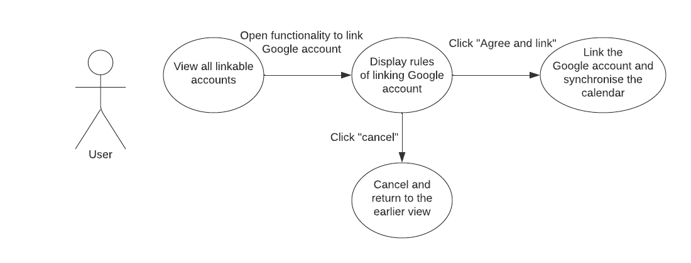

# Use Case Specifications template

## Use Case Identification and History

| **Use Case ID**         | ucs-10-linking-and-synchronising-calendar.md                                                  |
| ----------------------- | --------------------------------------------------------------------------------------------- |
| **Use Case Name**       | User can link and synchronise their calendar content                                          |
| **Related User Story**  |                                                                                               |
| **End Objective**       | Ability to link 3rd party accounts and see the synchronised calendar view                     |
| **Creator & time**      | Aleksanteri Fagerholm 12.10.2022                                                              |
| **Last Updater & time** |                                                                                               |
| **Approver & time**     |                                                                                               |
| **User/Actor**          | User                                                                                          |
| **Business Owner Name** |                                                                                               |
| **Trigger:**            | User selects that which account they want to link and then continue to click "agree and link" |
| **Frequency of Use:**   | Linking and syncrhonising only needs to be done once                                          |

## Preconditions

Signing in with Google or Microsoft account has been done succesfully

## Basic Flow

| **Step** | **User Actions**                           | **System Actions**                                        |
| -------- | ------------------------------------------ | --------------------------------------------------------- |
| 1        | User selects to link their Google account  | Google account linking page is opened                     |
| 2        | User clicks "agree and link" from the page | Google account gets linked and calendar gets synchronised |

## Alternate Flows

| **Step** | **User Actions**                       | **System Actions**                   |
| -------- | -------------------------------------- | ------------------------------------ |
| 1        | User clicks cancel on the linking page | Linking of the account gets canceled |

## Exception Flow

| **Step** | **User Actions**                           | **System Actions**                                        |
| -------- | ------------------------------------------ | --------------------------------------------------------- | --- |
| 1        | User selects to link their Google account  | Google account linking page is opened                     |
| 2        | User clicks "agree and link" from the page | Linking fails and system asks to reload the page          |
| 3        | User clicks the reload                     | page reloads                                              |
| 4        | User clicks "agree and link" again         | Google account gets linked and calendar gets synchronised |     |

## Post Conditions

User will see their synchronised calendar

## Includes or Extension Points

n/a

## Special Requirements

User must have synchronising enabled from their Google account

## Business rules

System must provide the terms and conditions and privacy policy of the linking

## Other Notes (Assumptions, Issues, etc.)

n/a
