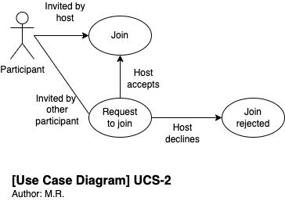

# Use Case Specifications template

## Use Case Identification and History

| **Use Case ID**         | ucs-6-host-record-meeting.md                |
| ----------------------- | ------------------------------------------- |
| **Use Case Name**       | Meeting host records the meeting            |
| **Related User Story**  | US-5, US-3                                  |
| **End Objective**       | Meeting is recorded, and store successfully |
| **Creator & time**      | Nico Hartto at 9.10.2022                    |
| **Last Updater & time** |                                             |
| **Approver & time**     |                                             |
| **User/Actor**          | Meeting host                                |
| **Business Owner Name** |                                             |
| **Trigger:**            | Meeting host                                |
| **Frequency of Use:**   | For most meetings, often                    |

## Preconditions

Meeting is started or in-progress.

## Basic Flow

| **Step** | **User Actions**              | **System Actions**                                               |
| -------- | ----------------------------- | ---------------------------------------------------------------- |
| 1        | Meeting host presses "record" | Recording is started                                             |
| 2        |                               | Meeting participants are notified that meeting is being recorded |
| 3        | Meeting is ended              | Meeting recording is stopped                                     |

## Alternate Flows

| **Step** | **User Actions**                      | **System Actions**                                               |
| -------- | ------------------------------------- | ---------------------------------------------------------------- |
| 1        | Meeting host presses "record"         | Recording is started                                             |
| 2        |                                       | Meeting participants are notified that meeting is being recorded |
| 3        | Meeting host presses "stop recording" | Meeting recording is stopped                                     |

## Exception Flow

| **Step** | **User Actions**                    | **System Actions**                                      |
| -------- | ----------------------------------- | ------------------------------------------------------- |
| 1        | Meeting host presses "record"       | Recording fails to start, Meeting host is notified      |
| 2        |                                     | Notification is shown that asks Meeting host to "retry" |
| 3        | Meeting host presses "record" again | Recording is started                                    |

## Post Conditions

Recording of meeting is stored in the system, and it is available.

## Includes or Extension Points

n/a

## Special Requirements

n/a

## Business rules

n/a

## Other Notes (Assumptions, Issues, etc.)

n/a
