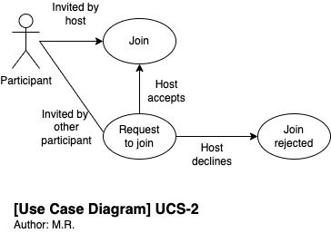

# Use Case Specifications template

## Use Case Identification and History

| **Use Case ID**         | usc-7-platform-provider-remove-recordings-after-retention-period.md |
| ----------------------- | ------------------------------------------------------------------- |
| **Use Case Name**       | Platform provider removes recordings after retention period         |
| **Related User Story**  |                                                                     |
| **End Objective**       | Any recordings store, are removed after 365 for cancelled accounts  |
| **Creator & time**      | Nico Hartto at 7.10.2022                                            |
| **Last Updater & time** |                                                                     |
| **Approver & time**     |                                                                     |
| **User/Actor**          | Customer of MeetCall                                                |
| **Business Owner Name** |                                                                     |
| **Trigger:**            | The system for any inactive account                                 |
| **Frequency of Use:**   | Once per account cancellation, if 365 days have passed              |

## Preconditions

There must be an active subscription and videos stored on the account.

## Basic Flow

| **Step** | **User Actions**               | **System Actions**                                                                           |
| -------- | ------------------------------ | -------------------------------------------------------------------------------------------- |
| 1        | Customer cancels their account | System acknowledges this, informs customer that data will be kept for 365 days but no longer |

## Alternate Flows

n/a

## Exception Flow

| **Step** | **User Actions**               | **System Actions**                                                                           |
| -------- | ------------------------------ | -------------------------------------------------------------------------------------------- |
| 1        | Account cancellation fails     | Notification is shown, would you like to try again later                                     |
| 2        | User tries again, and succeeds | System acknowledges this, informs customer that data will be kept for 365 days but no longer |

## Post Conditions

Stored video files and their different formats are deleted from storage, and they are no longer accessible.

## Includes or Extension Points

n/a

## Special Requirements

From legal perspective, we can not retain data longer that is needed. From storage perspective, even if storage is cheap we can save by automating the deletion.

## Business rules

GDPR has certain limitations, but as long as service provider has reasonable cause to keep the recordings, meaning there is a customer-provider relationship we can do so. Videos are removed after 365 days if:

1. account has been removed
2. 365 days have passed

## Other Notes (Assumptions, Issues, etc.)

n/a

As a platform provider (service provider) I want to remove recordings which are older than their retention period so that I can confirm to data collection regulations.
