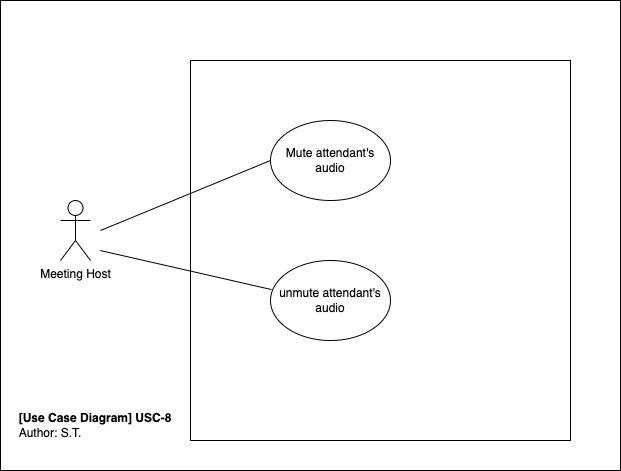

# Use Case Specifications

## Use Case Identification and History

| **Use Case ID**         | USC-8-host-control-participant-audio                                 |
|-------------------------|----------------------------------------------------------------------|
| **Use Case Name**       | Host controls participant's audio                                    |
| **Related User Story**  |                                                                      |
| **End Objective**       | The meeting host mutes or unmutes a participant's audio.             |
| **Creator & time**      | Simachew Tibebu 06.10.2022                                           |
| **Last Updater & time** |                                                                      |
| **Approver & time**     |                                                                      |
| **User/Actor**          | Meeting host                                                         |
| **Business Owner Name** |                                                                      |
| **Trigger:**            | Host presses the participants media buttons                          |
| **Frequency of Use:**   | When the host tries to mute a participant's microphone or disables a participants video |

## Preconditions

A meeting is progressing with a host and at least one participant.

## Basic Flow

| **Step** | **User Actions**             | **System Actions**             |
|----------|------------------------------|--------------------------------|
|        1 | Meeting host presses the microphone button of a participant. | The system toggles the mute state of the participant's microphone. |

## Alternate Flows

NA

## Exception Flow

| **Step** | **User Actions**                                               | **System Actions**      |
|----------|----------------------------------------------------------------|-------------------------|
|        1 | Meeting host presses the participant's microphone button. | The system doesn't toggle the mute state of the participant's microphone. |
|        2 |                                                           | The system retries to toggle the mute state of the microphone. |

## Post Conditions

A participant's microphone is muted or unmuted.

## Includes or Extension Points

NA

## Special Requirements

NA

## Business rules

NA

## Other Notes (Assumptions, Issues, etc.)
