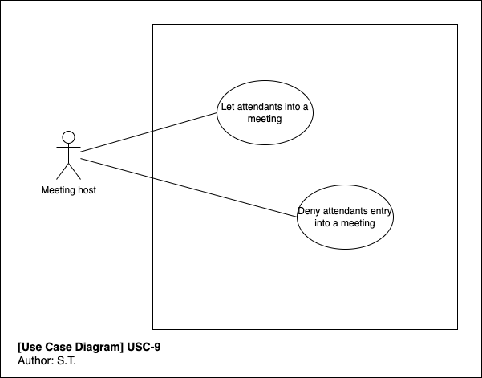

# Use Case Specifications

## Use Case Identification and History

| **Use Case ID**         | USC-9-allow-participant-entry-to-meeting                             |
|-------------------------|----------------------------------------------------------------------|
| **Use Case Name**       | Allow participant entry into meeting.                                |
| **Related User Story**  |                                                                      |
| **End Objective**       | The meeting host allows or denies a participant entry into a meeting.|
| **Creator & time**      |                                                                      |
| **Last Updater & time** |                                                                      |
| **Approver & time**     |                                                                      |
| **User/Actor**          | Meeting host                                                         |
| **Business Owner Name** |                                                                      |
| **Trigger:**            | The meeting host allows or denies a participant entry into the meeting. |
| **Frequency of Use:**   | Every time a meeting participant tries to join a meeting.            |

## Preconditions

The meeting host has already joined the meeting. A participant is waiting in the lobby trying to join the same meeting.

## Basic Flow

| **Step** | **User Actions**             | **System Actions**             |
|----------|------------------------------|--------------------------------|
|        1 |  Meeting host joins a meeting. |The system notifies the host how many participants are waiting in the lobby |
|        2 | Meeting host allows participants one by one into the meeting from the lobby. | The system adds the participant into the meeting. |
|        3 | A participant tries to join a meeting | The system notifies the participant to wait in the lobby. The system notifies the meeting host a participant wants to join the meeting. |
|        4 | The meeting host allows the participant into the meeting. | The system adds the participant from the meeting. |

## Alternate Flows

| **Step** | **User Actions**                                               | **System Actions**      |
|----------|----------------------------------------------------------------|-------------------------|
|        1 | The meeting host denies a participant entry into the meeting. (Step 2) | The system refuses the participant entry to the meeting. |
|        2 | The meeting host doesn't join the meeting.                     | The system notifies the participants to wait for the meeting host to join.                 |

## Exception Flow

| **Step** | **User Actions**                                               | **System Actions**      |
|----------|----------------------------------------------------------------|-------------------------|
|        1 | A participant tries to join a meeting. | The system lets the user in without the meeting host approval. |
|        2 | A meeting host denies entry to a participant                   | The system allows the participant into the meeting. |

## Post Conditions

The people present in the meeting are the participants that should be in the meeting. Those who are invited.

## Includes or Extension Points

NA

## Special Requirements

NA

## Business rules

NA

## Other Notes (Assumptions, Issues, etc.)

[NOTE] Only people invited to the meeting should be able to attend the meeting.
